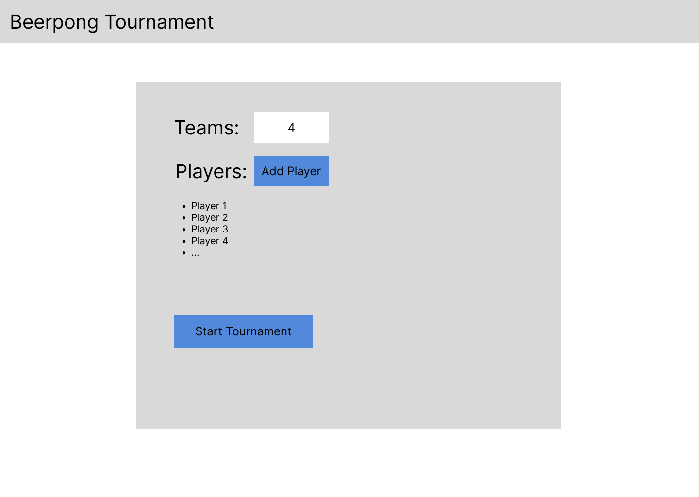
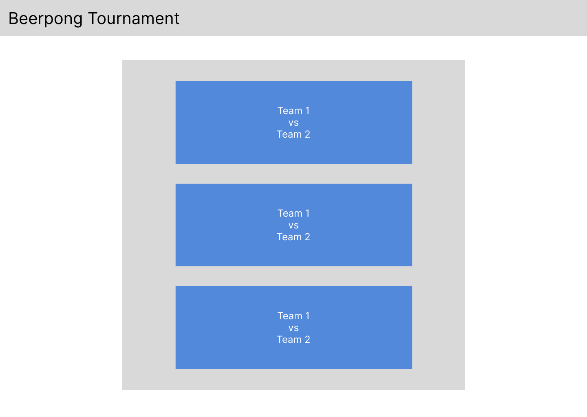
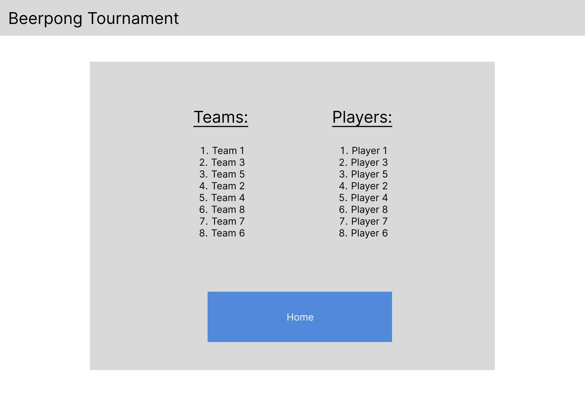

# Phase 1

## Scope

Phase 1 will allow users to login and create a tournament with up to 8 teams each consisting of up to two people per team. The tournament, teams and players will be unique to each user's account and cannot be accessed by any other user. The tournament format will be a single elimination tournament, each round will have its own page to view who plays who. For each game the scores can be recorded including what team won and how many cups each player hit. The scores will be displayed on a leader board showing what player has the most cups. The final stats will all be combined onto a results page to display the final tournament results and the cup leader board.

## Requirements

### Functional Requirements

 - The user should be able to create an account.
 - The user should be able to create a tournament linked to their account.
 - The user should be able to add teams to their tournament, from 1 to 8 teams.
 - The user should be able to add players to the teams in their tournament, from 2 to 16 players.
 - The user should be able to start the tournament after the teams and users have been added.
 - The user should be able to add the team and player scores for each game.
 - The user should be able to view upcoming games and the results of previous games.
 - The user should be able to see a leader board of what team and player has sunk the most cups.
 - The user should be able to view the results of the tournament after it has been complete.

### Non-Functional Requirements

 - <b>Speed:</b> The webpage must respond within 1 second.
 - <b>Availability:</b> The website should be up only when required.
 - <b>Capacity:</b> The website must be able to handle at least 1 user.
 - <b>Reliability:</b> The website must not crash when being used.
 - <b>Usability:</b> The website must have buttons and text input for users to interact with the system.

## Design

### User Interface Drawings

#### Home Page

#### Create Tournament Page

#### Play Tournament Page

#### Results Page

